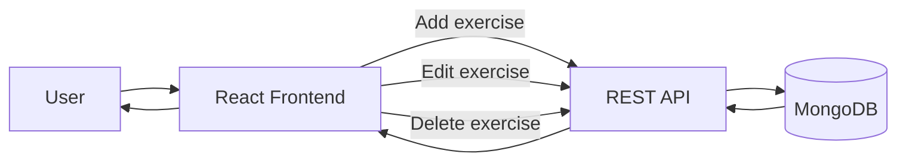
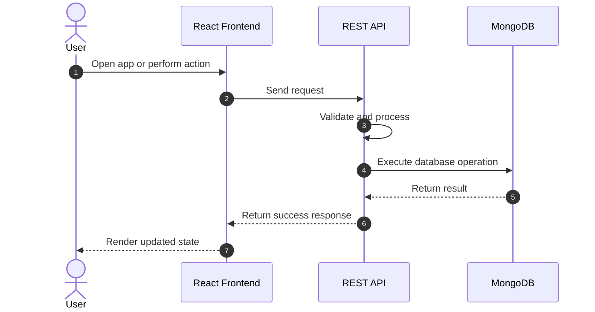

## Exercise Logger

Exercise Logger is a simple [MERN stack](https://www.mongodb.com/resources/languages/mern-stack?msockid=180ff8ba597364c73306ef8f582a656c) web app for tracking exercise sets.

## Overview

The app is split into three parts:

- React frontend for the user interface
- Express + Node REST API for application logic and validation
- MongoDB for persistent exercise storage

When you add, edit, or delete an exercise, the frontend sends a request to the REST API. The API validates the data, updates MongoDB, and the UI refreshes to show the latest state.

## How To Use

Open the [deployed app](https://dazzling-freedom-production.up.railway.app/) in your browser. From the home page, you can use the corresponding buttons: 

- **Add** and/or **Edit** exercises using the following fields:
    - Name (short label, e.g. `Squat`)
    - Reps (positive whole number)
    - Weight: (positive number)
    - Unit (`lbs` or `kgs`)
    - Date: (`MM-DD-YY`)

- **Delete** exercises

## High-Level Workflow

## Deployment Notes

- Frontend: Railway service hosting the React app
- REST API: Railway service hosting the Express server
- Database: MongoDB Atlas cluster

The frontend reads the REST API URL from `VITE_API_URL` at build time.